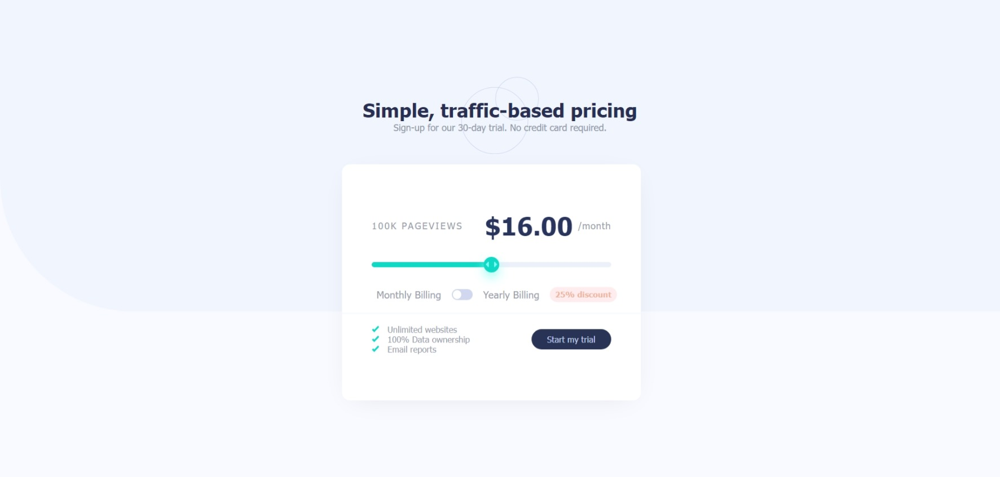

# Frontend Mentor - Interactive pricing component solution

This is a solution to the [Interactive pricing component challenge on Frontend Mentor](https://www.frontendmentor.io/challenges/interactive-pricing-component-t0m8PIyY8). Frontend Mentor challenges help you improve your coding skills by building realistic projects. 

## Table of contents

- [Overview](#overview)
  - [The challenge](#the-challenge)
  - [Screenshot](#screenshot)
  - [Links](#links)
- [My process](#my-process)
  - [Built with](#built-with)
  - [What I learned](#what-i-learned)
- [Author](#author)

## Overview

### The challenge

Users should be able to:

- View the optimal layout for the app depending on their device's screen size
- See hover states for all interactive elements on the page
- Use the slider and toggle to see prices for different page view numbers

### Screenshot



### Links

- Solution URL: [Solution](https://github.com/Fayozxon/interactive-pricing-card)
- Live Site URL: [Interactive Pricing](https://pricing-mentor.netlify.app/)

## My process

### Built with

- Semantic HTML5 markup
- CSS custom properties
- Flexbox
- Desktop-first workflow
- Google Fonts

### What I learned

I learned how to make custom range slider. In this web-page it is used to choose the pricing plan. I made it usin JS DOM and CSS variables.

To see how you can add code snippets, see below:

```html
<div class="range">
  <input type="range" style="--width: 50%" id="range" min="0" max="32">
</div>
```
```css
.range {
    width: 80%;
    padding: 35px 0;
}
.range input {
    position: relative;
    -webkit-appearance: none;
    width: 100%;
    height: 10px;
    background: #ebf0f9;
    border-radius: 15px;
    outline: none;
    z-index: 10;
}
.range input::after {
    content: '';
    position: absolute;
    top: 0;
    left: 0;
    width: var(--width);
    height: 100%;
    border-radius: 15px 0 0 15px;
    background-color: #0fd8c4;
    pointer-events: none;
    z-index: -1;

}
.range input::-webkit-slider-thumb {
    -webkit-appearance: none;
    width: 30px;
    height: 30px;
    border-radius: 50%;
    background-color: #0fd8c4;
    background-image: url('../images/icon-slider.svg');
    background-repeat: no-repeat;
    background-position: center;
    cursor: pointer;
    transition: 0.3s;
    box-shadow: 0 10px 20px #a5fff4;
}
.range input::-webkit-slider-thumb:active {
    background-color: #25aca1;
}
```
```js
function changePrice() {
    let value = range.value;
    sum.innerHTML = value;
    value *= 3
    range.setAttribute('style', '--width: '+value+'%;');
}
}
```

## Author

- YouTube - [F's Codes](https://www.youtube.com/channel/UC0gnEmyk1huMdAR8t-VZa4g)
- Frontend Mentor - [@fayozxon](https://www.frontendmentor.io/profile/fayozxon)
- GitHub - [@fayozxon](https://www.github.com/fayozxon)
